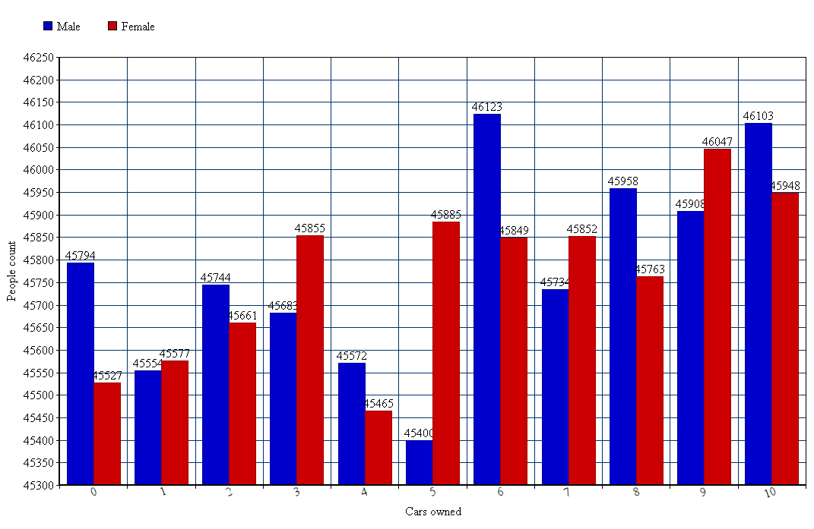

# Kacper Czechowicz - Zadanie 2, agregacje

Dane o ludziach, krajach w których żyją, ich płci, dacie urodzenia, miesięcznych zarobkach oraz ilości posiadanych samochodów wygenerowałem na stronie [http://www.mockaroo.com/](http://www.mockaroo.com/schemas/download).

Przykładowy rekord:
```javascript
{
	"id":1,
	"sex":"Male",
	"first_name":"Craig",
	"last_name":"Parker",
	"country":"Vietnam",
	"salary":778607,
	"birth":"11/13/1972",
	"carsOwned":0
}
```

Ilość danych:
```javascript
> db.people.count();
1000702
```

## Agregacja 1

Ile osób z bazy żyje w danym kraju malejąco:
```javascript
> db.people.group({ 
	key: { country: true},
	initial: {count: 0}, 
	reduce: function(doc, out) {out.count++;} 
}).sort(function(a,b){ return b.count - a.count; });
```
Wynik w postaci tabelki: [agregacja1.md](wyniki/agregacja1.md)

## Agregacja 2

Średnia posiadanych samochodów przez kobiety i mężczyzn:
```javascript
db.people.group({ 
	key: { sex: true}, 
	initial: {count: 0, total_cars: 0}, 
	reduce: function(doc, out) {out.count++; out.total_cars+=doc.carsOwned;},  
	finalize: function(out) { out.avg_carsOwned = out.total_cars / out.count; }
});
```

Wynik: 


Json: [agregacja2.json](wyniki/agregacja2.json)

## Agregacja 3

Suma kobiet i mężczyzn dla każdej ilości samochodów posiadanych
```javascript
db.people.group({ 
	key: { carsOwned: true}, 
	initial: { male: 0, female: 0 }, 
	reduce: function(doc, out) { if(doc.sex === "Male") out.male++; else out.female++; },  
}).sort(function(a,b){ return b.carsOwned - a.carsOwned; });
```
Wynik:


Json: [agregacja3.json](wyniki/agregacja3.json)

## Agregacja 4

5 krajów w ktorych najlepiej zarabiają kobiety
```javascript
db.people.group({ 
	cond: { sex : "Female" },
	key: { country: true}, 
	initial: { count: 0, total_salary: 0 }, 
	reduce: function(doc, out) { out.count++; out.total_salary+= doc.salary; },  
	finalize: function(out) { out.avg_salary = out.total_salary / out.count; }
}).sort(function(a,b){ return b.avg_salary - a.avg_salary; }).slice(0, 5);
```

Wynik:


Json: [agregacja4.json](wyniki/agregacja4.json)